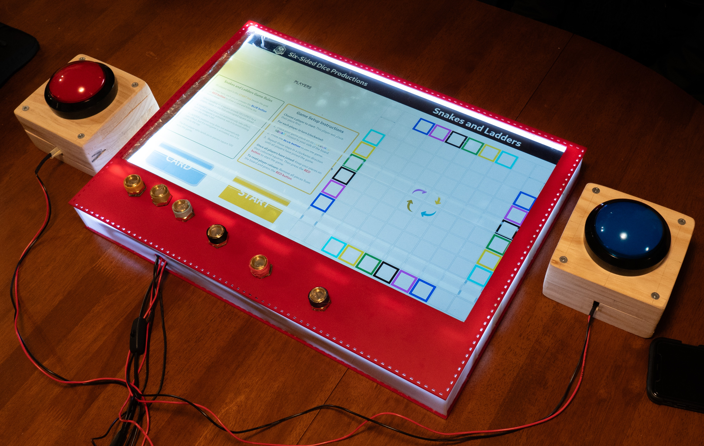

# The TEBS (Technology-Enhanced Board Game System)  by Six-Sided-Dice

## Project Details  

[Project 17T - Technology Enhanced Tabletop Board Game](materials/Brief%20-%2017T%20Technology%20Enhanced%20Tabletop%20Board%20Game.pdf)  

## Six-Sided Dice - Members & Roles  

STUART MOYES - Team Leader, Product Owner, Hardware (Device Build and Software) 
ERIK KELEMEN - Hardware (Device Build and Software) 
GARRETT BARGEWELL - Backend Software 
YUVRAJ FOWDAR - Backend Software 
LIN SOETANTO - Frontend and Backend Software 
CHRISTINA RUSSO - Design, Frontend Software, Testing, Team Admin

## Repository Organsation 

This repository is organised into the following folders: 
- materials: containing the supporting documents and images for this Readme file. 
- product:  containing the project codebase for both hardware, backend and frontend. 

## Video

This [video](https://drive.google.com/file/d/1xVoj_Eiwpj51UO0Rtrk1rOHaiAB83Vxe/view?usp=sharing) showcases our marketing pitch, details the game mechanics, and includes a gameplay example.  

## Device Specifications

The TEBS (Technology-Enhanced Board Game System) is not just a digital game.  It is a unique gaming system that combines the interactive gameplay of digital board games with the tactile feel and social advantages of physical board games.

It's features include: 

<ul>
<li>Hardware</li>
<ul>
<li>Physical game pieces and large buttons to communicate player movement to the digital display in real-time.</li>
<li>An inbuilt Raspberry Pi 4B to automatically compute game states and movement, current player tracking, winner declaration, and board updates.</li>
<li>Flexible grid sizing using up to 100 positions/squares to incorporate multiple game designs.</li>
<li>Over 200 electronic components, including 100 magnetic sensors, under the board to detect physical player pieces and button presses.</li>
<li>Portable, closed system that can be played offline wherever your table is. (Power required)</li>
<li>Detachable buttons that can be easily replaced if required.</li>
</ul>
<li>Software</li>
<ul>
<li>This prototype includes our first game "Snakes and Ladders" with a twist - incorporating different game mechanics and minigames (Wild Goose Chase, Falling Fruits and Pest Control) to enhance the player experience.</li>
<li>Unique game mechanics that give players a shortcut, detour or chance to steal the lead, swap snakes and ladders positions, and assist lagging players to catch up to the pack. </li>
<li>Mulltiple engaging and interactive user interfaces providing real-time instructions, feedback and prompts to each player throughout the game. </li>
<li>Card instructions rotate towards current player's seated position around the board (calculated at setup) for ease of reading.</li>
<li>Transitions and animations simulate playing cards, alert players to an incorrect piece position or prompt them to take their turn.</li>
<li>Players are identified by their piece colour during a game. Players' personal details are not requested or stored.
<li>Modular software design organises game board and information whilst allowing for future game expansion. </li>
<li>Accessibility-friendly with colours chosen to assist people with colour vision deficiencies and achieves a AAA rating for the WCAG's Contrast (Enhanced) Success Criterion.</li>
</ul> 
</ul>

Content rating:  The content of the Snakes and Ladders game is consistent with computer game classification [General (G)](https://www.classification.gov.au/classification-ratings/what-are-ratings), being suitable for the whole family.

Warning:  NOT SUITABLE FOR CHILDREN UNDER 3 YEARS AS PLAYER PIECES, MAGNETS AND LONG CORDS ON EXTERNAL BUTTONS MAY CAUSE A CHOKING HAZARD. 
This  warning is provided in an attempt to comply with section 6 of the  [Consumer Goods (Toys for Children up to and including 36 months of age) Safety Standard 2023](https://www.legislation.gov.au/F2023L01185/latest/text). 

## Device Instructions

- To turn on the TEBS device, plug its power cord into 240v mains powerpoint.  Switch is located on the power cord.
- When turned on, the device will automatically boot into the Snakes and Ladders game after a few moments. 
- Follow the game instructions on the display to join and play the game. 
- To turn off the TEBS device, turn power switch off and unplug power cord.

## To install and run the game in a Git Bash shell on a Windows computer

These instructions remain in the prototype code to assist with code debugging and game demonstration on a computer, but will not be available to users of the device.

To start game in web browser:

<ol>
    <li>Install Node.js</li>
    <li>Navigate to /Six-Sided-Dice-TEBS directory
    <li>(First time only) Run "./product/setup.sh" to install dependencies
    <li>Run "./product/run.sh"  (This step may need to be done twice if you receive an error)
</ol>

 Instructions for game moves without physical game pieces:
<ul>
    <li>Game starts in the setup window.</li>
    <li>Load a new game with four players by typing 'load' and press Enter.</li>
    <li>Follow the instructions on the player cards and in the bash window to move through the game, typing '1' or '2' for the blue and red buttons respectively.</li>
    <li>Wild Goose Chase:  Press space to simulate a win condition, or let the timer run out to simulate a lose condition.</li>
    <li>Falling Fruits:  Use the left and right arrow keys to move the basket to catch the fruit.</li>
    <li>Pest Control:  Hit the left or right arrow key to stop the fly on the coloured square. (One attempt only.)</li>
    <li>Continue to play until the game ends.  Follow the card instructions to reset if desired. </li>
</ul>

## Snakes and Ladders Game Phases

Setup Phase: 
- Each player selects their piece colour and joins the game. Players can easily reset this phase if a wrong colour has been chosen.
- The game remembers each player's position around the board to orientate game instructions towards that player during their turn.

Game Play Phase: 
- The game verifies that the previous player has completed their move and prompts the next player.</li>
- If the previous player is positioned on an incorrect square, that player is notified so the error can be corrected.</li>

Draw Card Phase: 
- The game provides each player with instructions from the card they have drawn. 
- Cards govern normal player movement as well as other game mechanics such as swapping positions, missing a turn, reversing snakes and ladders on the board etc. 

Minigame Phase: 
- When landing on a snake's head or ladder's bottom rung, players must win a minigame to avoid the negative conseuqences of these positions.  
- Three minigames are available:  Wild Goose Chase, Falling Fruits and Pest Control which require different skills such as eye-hand coordination or timing via piece movement or button presses to successfully complete. 

Game Over Phase
- Declares a player as the winner of a game, and allows the game to be reset in order to play another round. 

Various UIs from the Game Phases:

Minigames:

Frontend Code structure showing modular design

## Device Hardware

Inside the TEBS device

### Components
| Name | Qty | Model ID | Brand |
| ---- | --- | -------- | ----- |
| Hall-Effect Sensor | 100 | DRV5032DULPGM | Texas Instruments |
| 10k Resistor | 100 | CFM12JT10K0 | Stackpole Electronics |
| Parallel-in Shift Register | 20 | CD74HC165E | Texas Instruments |
| Raspberry Pi 4B | 1 | Raspberry Pi 4B 4GB | Raspberry Pi |
| 24" LCD Panel | 1 | LG 24M38H-B | LG |
| Male-to-Female Dupont Jumper Wires | 80 | Jumper Wire 10cm Ribbon (M/F) | Core Electronics |
Solderless Breadboard | 1 | Solderless Breadboard - 830 Tie Point (ZY-102) | Core Electronics |
10mm x 2mm Neodymium Magnets | 24 | Generic | Ali-Express |

## Attributes

Hardware: 
- Printed circuit boards (PCBs) manufactured by [PCBway](https://www.pcbway.com/) from [Sensor Array Blueprint](materials/Sensor%20Array%20Blueprint.pdf) and [Sensor Array Schematic](materials/Sensor%20Array%20Schematic.pdf) created by Stuart Moyes and Erik Kelemen

Libraries: 
- [Raspberry Pi GPIO library](https://sourceforge.net/p/raspberry-gpio-python/wiki/Home/)
- [Fast API for backend server and WebSocket server](https://fastapi.tiangolo.com/)
- [React.js for frontend web app](https://react.dev/)
- [Vite for frontend build tool](https://vite.dev/)
- [react-use-websocket for frontend WebSocket client library](https://github.com/robtaussig/react-use-websocket)
- [pynput for debugging and emulating player input without hardware](https://pynput.readthedocs.io/en/latest/)

Figma Plugins: 
- Colour-blind checks of UI colours conducted using [Color Blind](https://www.figma.com/community/plugin/733343906244951586) 
- Colour contrast checks of UI display conducted using [A11y Color Contrast Checker](https://www.figma.com/community/plugin/733159460536249875)  

Royalty Free Icons from [Flaticon.com](https://www.flaticon.com/): 
- Clockwise Arrows in setup phase game grid adapted from [upward arrow](https://www.flaticon.com/free-icon/upward-arrow_2268143?term=curved+arrow&page=1&position=12&origin=search&related_id=2268143) icon created by Creative Stall Premium 
- Goose image in Wild Goose Chase minigame from [goose](https://www.flaticon.com/free-icon/goose_2707763?term=goose&page=1&position=21&origin=search&related_id=2707763) icon created by Freepik 
- Ripe Fruit image in Falling Fruit minigame from [fruits](https://www.flaticon.com/free-icon/fruits_1625048?term=fruit&page=2&position=32&origin=style&related_id=1625048) icon created by Freepik 
- Rotten fruit image in Falling Fruit minigame from [apple](https://www.flaticon.com/free-icon/fruits_1625048?term=fruit&page=2&position=32&origin=style&related_id=1625048), [rotten](https://www.flaticon.com/free-icon/rotten_4114810?page=2&position=2&%20term=rotten+fruit&origin=style-search&related_id=4114810), and [banana](https://www.flaticon.com/free-icon/banana_2494112?page=1&position=4&%20term=banana&origin=style-search&related_id=2494112) images by Freepik 
- Basket image in Falling Fruit minigame from [basket](https://www.flaticon.com/free-icon/basket_3649105?term=food+basket&page=1&position=31&origin=style&related_id=3649105) icon by Freepik 
- Fly image in Pest Control minigame from [fly](https://www.flaticon.com/free-icon/fly_1198077?term=fly+insect&page=1&position=4&origin=search&related_id=1198077) icon by Pixel Perfect 

Videos:
- Video edited using Clipchamp, Sound Recorder and Snipping Tool.
- Pitch: [montage music](https://uppbeat.io/t/kidcut/skateboard-in-my-hands), licence code 8UJ8DUNICJI9GJQO, retrieved 14/10/24 
- Pitch: [background pitch music](https://pixabay.com/music) by Alana Jordan from Pixabay, retrieved 16/10/24

AI Generation: 
- The Six-Sided Dice team [logo](https://copilot.microsoft.com/images/create/a-logo-of-a-design-company-showing-a-6-sided-dice-/1-66a2e8ea4f64491c9184c987cd5d10bb) was adapted from an image created using Dali 3 via Copilot Designer, using the prompt "A logo of a design company showing a 6 sided dice with the caption "Six Sided Dice Productions"" 

